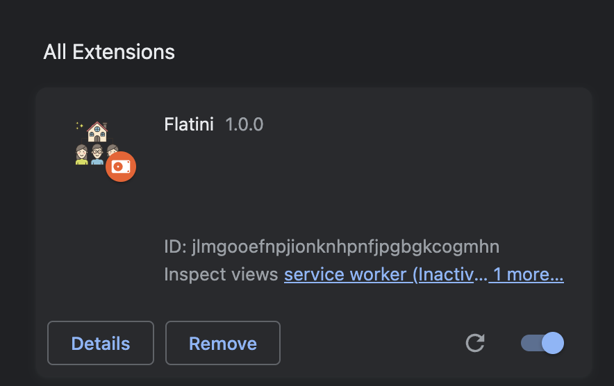
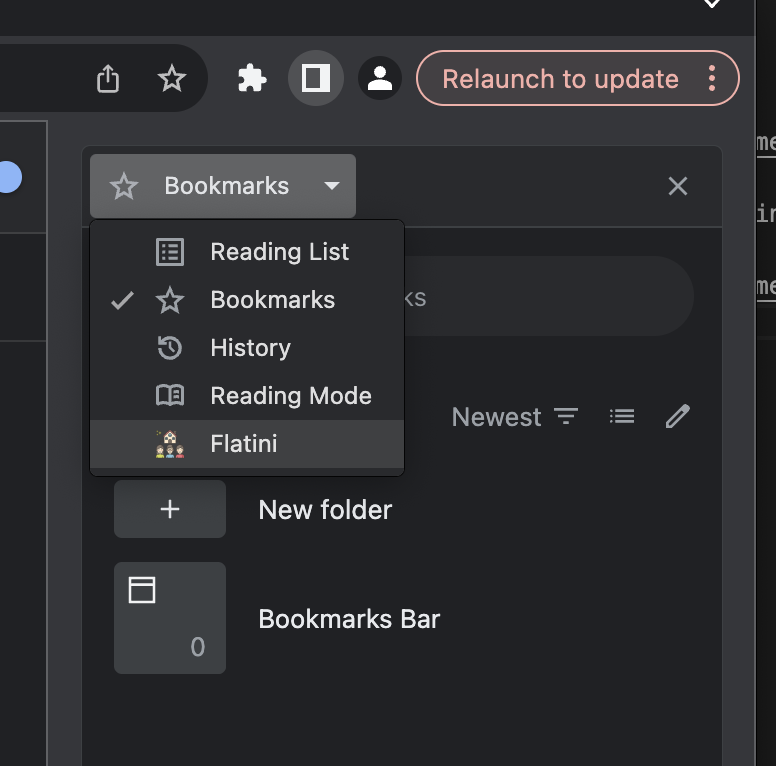

# Flatini

Helps organise your flat share search

  
Frontend

  
  Front end section

  
Backend

Located under the [backend](./backend/) directory of the project. A python based serverless application handling backend tasks including authentication, api, and data.

- live at https://gbjrcfuc7b.execute-api.eu-west-2.amazonaws.com/groups/5130831f-f57f-42e6-87fc-894ba74eea6e
- Install packages
  - `pip install -r requirements.txt && pip install -r requirements-test.txt`
- Deploy
  - must have a local samconfig.toml file which contains nessecary secrets, optionally when doing a sam deploy, add the -g flag to do a guided deployment https://docs.aws.amazon.com/serverless-application-model/latest/developerguide/sam-cli-command-reference-sam-deploy.html
  - `clean_build_winblows.cmd` (for windows) `clean_build.sh` (for unix)
  - `sam deploy`
- Run tests - `python -m unittest`

  
Browser Extension

Located under the [client](./client/) directory of the project. A JS based chrome extension.

- In a terminal, change folder to the client folder under the root of the project
- Install packages
  - `npm install`
- Build extension
  - `npm run build`
- Open extension in browser

  

- Switch into developer mode

  

    
    TO
    
  

- Load unpacked extension into Chrome [Brave unfortunately doesn't support side panels at this time]

  - Click Load unpacked button
  - Select the dist directory

    

  - You will now see Flatini loaded into your extension.

    

- Open the side panel and select Flatini extension

  

This project uses <a href="https://www.flaticon.com/free-icons/partnership" title="partnership icons">Partnership icons created by Flat Icons - Flaticon</a>
