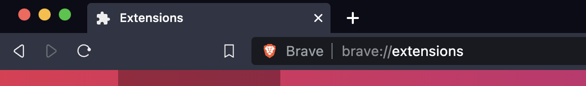
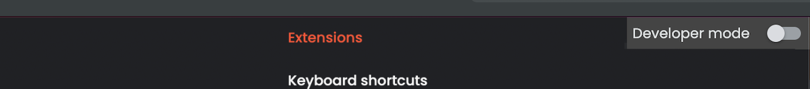
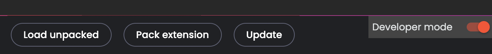
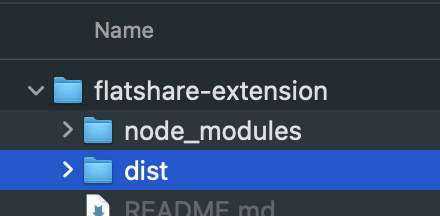

# Flatshare Extension

A browser extension that helps organise your flatshare search

This project uses <a href="https://www.flaticon.com/free-icons/partnership" title="partnership icons">Partnership icons created by Flat Icons - Flaticon</a>

# First time

- Clone repo to your development environment
- Install packages
  - `npm install`
- Build extension
  - `npm run build`
- Open extension in browser
  

- Switch into developer mode
  

  

- Load unpacked extension into Chrome or Brave

  - Click Load unpacked button
  - Select the dist directory

    
